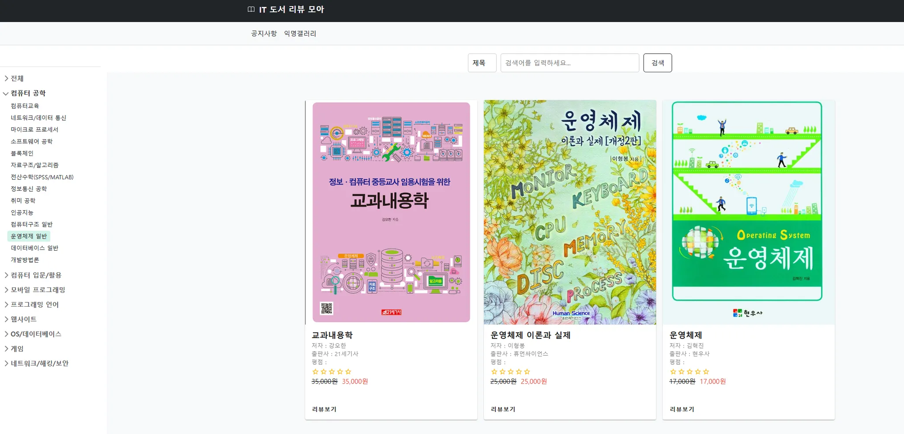
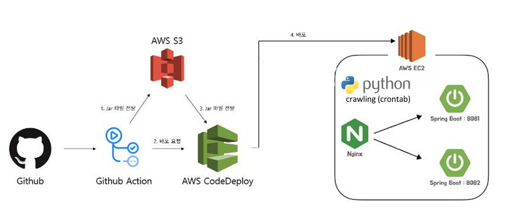
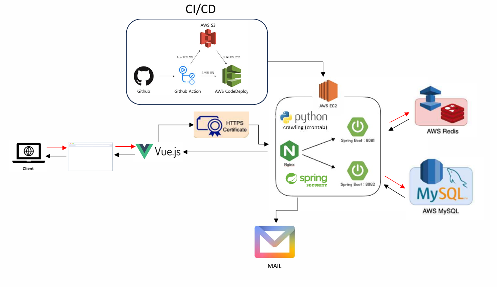

# 📖 IT 도서 리뷰 모아 보는 서비스



- 서비스 URL : https://reviewmoa.me

<br>

## 프로젝트 소개

- "IT 도서 리뷰 모아"는 국내 각 도서사이트(인터파크, YES24, 교보문고 등)에 등록되어있는
  사람들의 리뷰 데이터를 한 데 모아서 볼 수 있는 서비스입니다. <br><br>

- 도서 별 카테고리화를 통해 원하는 카테고리의 도서&리뷰 데이터를 조회할 수 있습니다. <br><br>

- 자유 게시판 (현재는 폐쇄) / 익명 게시판을 통해 이용자들과 의견을 교류할 수 있습니다. <br><br>


<br>

## 1. 개발 환경
- Back-end    : Spring Boot, Java 17, JPA, QueryDSL, Redis, Spring Security, Python <br><br>
- Front-end   : Vue3 / Vuetify / Bootstrap <br><br>
- OS          : Linux Ubuntu (AWS EC2)
- CI/CD       : Github Action, AWS EC2, S3, Code Deploy
- DB          : AWS RDS (MySQL)

<br>

## 2. 채택한 개발 기술과 브랜치 전략
- 회원 기능 개발 시, Redis, JWT 적용함으로써 추후 OAuth 로그인 개발 등 확장성을 고려. <br>
  DB 조회가 필요 없으므로 Server shutdown & 보안성 향상. <br>
  axios Interceptor을 적용하여 AccessToken / Refresh Token 핸들링. <br>
  쿠키 + jwt 방식을 채택하여 자동 로그인 방식 구현. <br><br>

- Python, Beautifulsoup을 활용하여 국내 도서 사이트 도서&리뷰 데이터 크롤링 & 스케줄링 <br><br>

- 브랜치 전략은 따로 진행 X (1인 프로젝트라 필요성 못느낌)


## 3. 개발 & 운영 기간
- 개발 : 2024.03 ~ 2024.06
- 운영 : 2024.06 ~ 현재 


## 4. 개발 기능
- 회원 서비스(이메일 회원가입 / 로그인 / 로그아웃 / 새 비밀번호 설정 / 회원 정보 변경 / 회원탈퇴) <br>
- 마이페이지 (작성 게시글 조회 / 작성 댓글 조회 / 등록 / 수정 / 삭제)
- 도서 사이트 별, 도서 정보 & 평점 / 리뷰 평점 & 리뷰 내용 확인
- 도서&리뷰 데이터 크롤링 스케줄링
- 자유게시판 / 익명 게시판


## 5. 개선사항
- 도서 전체 조회 시, 특정 도서 중복 조회 이슈 처리.
- 도서 조회 시, 로컬 캐시를 적용하여 성능 개선 (약 1.5초 -> 약 0.015초, 100배 개선).
- 코드 중복 최소화 및 간소화 (리팩토링).

## 6. 변경사항
- 테스터 피드백 반영으로 인한 기존 로그인 & 자유 게시판 서비스 중지

## 7. 프로젝트 핵심 구조
```
├── README.md
├── frontend
│    └── public
│           └── index.html          
├── src
│    ├── api
│    │    └── index.js
│    │
│    ├── assets
│    │      └── logo.png
│    │
│    ├── components
│    │      └── DashBoard
│    │              ├── Forum.vue
│    │              ├── ForumDetail.vue
│    │              ├── ForumModify.vue
│    │              ├── ForumPost.vue
│    │      ├── Announcement.vue
│    │      ├── Card.vue
│    │      ├── Footer.vue
│    │      ├── Header.vue
│    │      ├── PrivacyPolicy.vue
│    │      ├── ReviewTitleList.vue
│    │      └── SearchBox.vue
│    │                                       
│    ├── pages
│    │     └── member
│    │           ├── Login.vue
│    │           ├── Signup.vue 
│    │     ├── AnnouncementList.vue
│    │     └── Home.vue
│    │
│    ├── plugins
│    │     └── vuetify.js
│    │
│    ├── scripts
│    │     ├── lib.js
│    │     ├── router.js
│    │     ├── store.js
│    │
│    ├── App.vue
│    └── main.js
│
│  
├── src
│    └── main
│         ├── java
│               └── com
│                    └── jung0407
│                            └── it_book_review_app
│                                        ├── configuration
│                                                 └── CacheManagerConfig
│                                                 └── QueryDslConfig
│                                        ├── controller
│                                                 ├── BookController
│                                                 ├── CommentController
│                                                 ├── ForumController
│                                                 └── ReviewController
│                                        ├── exception
│                                                 ├── ApplicationException
│                                                 ├── ErrorCode
│                                                 └── GlobalControllerAdvice
│                                        ├── model
│                                              └── dto
│                                                   ├── requestDTO
│                                                           ├── BookSearchConditionDTO
│                                                           ├── CommentDeleteRequestDTO
│                                                           ├── CommentRequestDTO
│                                                           ├── ForumSearchConditionDTO
│                                                           ├── PostCreateDTO
│                                                           ├── PostDeleteRequestDTO
│                                                           ├── PostModifyRequestDTO
│                                                           ├── PostValidateRequestDTO
│                                                           ├── ReplyDeleteRequestDTO
│                                                           ├── ReplyRequestDTO
│                                                           └── ReviewSearchConditionDTO
│                                                   ├── responseDTO
│                                                           ├── BookPagingResponseDTO
│                                                           ├── BookResponseDTO
│                                                           ├── CommentDTO
│                                                           ├── ForumPaginationDTO
│                                                           ├── ForumPagingResponseDTO
│                                                           ├── ForumResponseDTO
│                                                           ├── PostModifyResponseDTO
│                                                           ├── ReplyDTO
│                                                           ├── ResponseResultCode
│                                                           ├── ReviewPagingResponseDTO
│                                                           └── ReviewResponseDTO
│                                                   ├── BookPaginationDTO
│                                                   └── ReviewPaginationDTO
│                                              ├── entity
│                                                    ├── BookRepository
│                                                    ├── BookRepositoryCustom
│                                                    ├── CommentRepository
│                                                    ├── CommentRepositoryImpl
│                                                    ├── CustomCommentRepository
│                                                    ├── ForumRepository
│                                                    ├── ForumRepositoryCustom
│                                                    ├── MemberRepository
│                                                    ├── RecommendEntityRepository
│                                                    └── ReviewRepositoryCustom
│                                              ├── service
│                                                    ├── BookService
│                                                    ├── CommentService
│                                                    ├── ForumService
│                                                    └── ReviewService
│                                              ├── util
│                                                    ├── BookMainCategory
│                                                    ├── BookSubCategory
│                                                    ├── CommentDeleteStatus
│                                                    ├── MemberRole
│                                                    └── ReviewSource
│                                              └── ItBookReviewAppApplication
│         └── resources
│                 ├── static
│                 ├── template
│                 └── application.yaml
```
<br>


## 7. CI/CD 아키텍처



## 8. FE/BE 시스템 아키텍처


