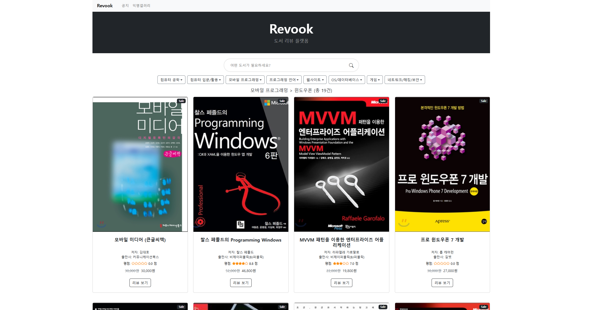

# 📖 Revook (도서 리뷰 서비스)

- 서비스 URL : https://reviewmoa.me

 

## 프로젝트 소개

- "Revook"은 국내 각 도서사이트(인터파크, YES24, 교보문고 등)에 등록되어있는
  사람들의 리뷰 데이터를 한 데 모아서 볼 수 있는 서비스입니다.   

- 도서 별 카테고리화를 통해 원하는 카테고리의 도서&리뷰 데이터를 조회할 수 있습니다.   

- 자유 게시판 (현재는 폐쇄) / 익명 게시판을 통해 이용자들과 의견을 교류할 수 있습니다.   

 

## 1. 개발 환경
- Back-end    : Spring Boot, Java 17, JPA, QueryDSL, Redis, Spring Security, Python   
- Front-end   : Vue3 / Vuetify / Bootstrap   
- OS          : Linux Ubuntu (AWS EC2)
- CI/CD       : Github Action, AWS EC2, S3, Code Deploy
- DB          : AWS RDS (MySQL)

 

## 2. 적용한 기술과 브랜치 전략

- 브랜치 전략은 따로 진행 X   

- 회원 토큰 관리는 Redis RTR 방식으로 Refresh Token 관리  
  -> DB 조회 필요 X (DISK I/O 발생 감소)   
  -> 토큰 갱신 성능 향상   

- axios Interceptor을 적용하여 AccessToken / Refresh Token 핸들링.  
  쿠키 + jwt 방식을 채택하여 자동 로그인 방식 구현.   

- Python, Beautifulsoup을 활용하여 국내 도서 사이트 도서&리뷰 데이터 크롤링 & 스케줄링   

## 3. 개발 & 운영 기간
- 개발 : 2024.03 ~ 2024.06
- 운영 : 2024.06 ~ 현재 

## 4. 개발 기능
- 회원 서비스(이메일 회원가입 / 로그인 / 로그아웃 / 새 비밀번호 설정 / 회원 정보 변경 / 회원탈퇴)  
  -> 현재는 폐쇄
- 도서 사이트 별, 도서 정보 & 평점 / 리뷰 평점 & 리뷰 내용 확인
- 도서&리뷰 데이터 크롤링 스케줄링
- 자유게시판 / 익명 게시판

## 5. 개선사항
- 도서 전체 조회 시, 특정 도서 중복 조회 이슈 처리
- 도서 조회 시, 로컬 캐시를 적용하여 성능 개선 (약 1.5초 -> 약 0.015초, 100배 개선)
- 코드 중복 최소화 및 간소화 (리팩토링)
- 로컬 캐시를 적용하여 도서 페이징 데이터 조회 성능 개선 (약 1.5초 -> 0.01초)  
  -> 단일 서버이므로, 이용자 수가 많을 경우 로컬 캐시로는 페이지 별 데이터를 캐시에 적재하는 건 부담  
  -> Slice 기반 Infinite-Scroll 방식으로 대체하여 데이터 조회 소요 시간 약 0.3초 소요되나 UI/UX 향상   

## 6. 변경사항
- 테스터 피드백 반영으로 인한 기존 로그인 & 자유 게시판 서비스 중지

## 7. CI/CD 아키텍처

## 8. FE/BE 시스템 아키텍처

